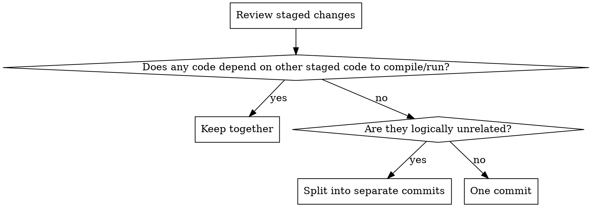

# Writing Commit Messages

## Core Principle

A commit message exists for the person reading `git log` six months from now. Tell them **why** this change exists — the diff already shows *what* and *how*.

## Pre-Commit Checklist

Before writing any commit message:

1. **Run lints** — all linters must pass before committing. Do not skip or `--no-verify`.
2. **Update documentation** — if the code change should reflect updates in any docs or architecture files, update them first and include in the commit. If the documentation changes would be too big (e.g. complicated "whys", etc) create a separate commit about updating documentation.
3. **NEVER commit AI-generated plan files** (e.g., in-progress planning docs generated by Superpowers or similar agent workflows). These are ephemeral agent guidance, not project documentation.
4. **Review staged changes** for atomicity (see below).

## Atomic Commits

Split changes into the smallest **independently revertable** unit. The goal: `git revert <hash>` and `git bisect` should always work cleanly.



**The rule:** Code that depends on other code to exist (compile, run, pass tests) belongs in the same commit. Logically independent changes get separate commits — even if they touch the same file.

**Examples:**
- Refactor + bug fix = two commits (the fix matters for bisect)
- Typo fix + config change + style fix = three commits
- New function + its tests + its caller = two commits (caller depends on the definition, but tests can be added separately)
- Logic + UI = two commits (UI can technically exist without logic; it's not going to crash or cause any signficant error)

## Gitmoji Convention

Use GitHub shortcode syntax (`:emoji_name:`) combined with Conventional Commits. The emoji provides instant visual semantics; the type provides machine-parseable structure.

**Format:** `:gitmoji: type(scope): imperative description`

Prefer more specific gitmojis over general ones (e.g. new login page logic would be `:passport_control:`, not `:sparkles:`)

### Most Common Gitmoji

| Gitmoji | Use for |
|---------|---------|
| :sparkles: | New feature |
| :bug: | Bug fix |
| :ambulance: | Critical hotfix |
| :recycle: | Refactor code |
| :fire: | Remove code or files |
| :art: | Improve structure / format |
| :zap: | Performance improvement |
| :memo: | Documentation |
| :white_check_mark: | Add or update tests |
| :arrow_up: | Upgrade dependencies |
| :arrow_down: | Downgrade dependencies |
| :construction_worker: | Create/Revise CI build system |
| :wrench: | Configuration files |
| :lock: | Security fix |
| :truck: | Move or rename files |
| :boom: | Breaking changes |
| :lipstick: | UI and style files |
| :adhesive_bandage: | Simple non-critical fix |
| :pencil2: | Fix typos |
| :card_file_box: | Database changes |
| :label: | Types |
| :construction: | Work in progress |
| :see_no_evil: | .gitignore |
| :rotating_light: | Fix linter warnings |
| :building_construction: | Architectural changes |
| :safety_vest: | Validation |
| :goal_net: | Catch errors |
| :bulb: | Source code comments |
| :passport_control: | Auth, roles, permissions |
| :thread: | Concurrency |
| :wastebasket: | Deprecate code |

Full reference: https://gitmoji.dev/

### Gitmoji + Conventional Commits Pairing

| Type | Gitmoji | Combined example |
|------|---------|-----------------|
| `feat` | `:sparkles:` | `:sparkles: feat(auth): add SSO login` |
| `fix` | `:bug:` / `:ambulance:` | `:bug: fix(cart): prevent negative quantities` |
| `refactor` | `:recycle:` | `:recycle: refactor(api): flatten nested handlers` |
| `docs` | `:memo:` | `:memo: docs: update API migration guide` |
| `test` | `:white_check_mark:` | `:white_check_mark: test(auth): cover token expiry` |
| `ci` | `:construction_worker:` / `:octocat:` | `:octocate: ci: create GitHub Action build workflow` |
| `perf` | `:zap:` | `:zap: perf(db): add index on user_id` |
| `build` | `:arrow_up:` / `:wrench:` | `:arrow_up: build(deps): upgrade React to 19` |
| `chore` | `:art:` | `:art: style: apply prettier formatting` |
| `feat` | `:lipstick:` | `:lipstick: style: made CTA button white -> blue` |
| `chore` | `:wrench:` | `:wrench: chore: update .env.example` |

## Writing the Subject Line

**Format:** `:gitmoji: type(scope): imperative description`

**Rules:**
1. **50 characters max** (hard limit: 72, not counting the gitmoji shortcode). If you can't fit it, the commit is doing too much.
2. **Imperative mood** — "add", "fix", "remove", not "added", "fixes", "removed"
3. **Lowercase after colon** — `:bug: fix(auth): handle null user`, not `Handle null user`
4. **No period at end**
5. **Say why, not what** — the diff shows what changed. When you don't know the "why", ask — or if the change is truly self-explanatory (e.g., `:pencil2: fix(docs): correct "recieve"` or `:sparkles: feat(auth)`), the "what" is acceptable.

```
# BAD: says what (the diff already shows this)
:bug: fix(auth): add null check before accessing user.email

# GOOD: says why
:bug: fix(auth): prevent crash when user session expires

# BAD: too long, lists multiple things
:recycle: refactor(payment): extract validation helper, rename functions, and remove dead code

# GOOD: one purpose, concise
:recycle: refactor(payment): consolidate duplicated validation logic

# BAD: wrong gitmoji and type
:sparkles: feat(deps): upgrade React to 19.0

# GOOD: correct gitmoji and type
:arrow_up: build(deps): upgrade React to 19.0
```

## Writing the Body (When Needed)

Add a body when the subject alone doesn't explain **why** this change was made.

**Skip the body for:**
- Truly self-explanatory changes (`:pencil2: fix(docs): correct "recieve" in error message`)
- Single-line fixes where the subject captures the intent

**Include a body for:**
- Bug fixes (what was the bug? what caused it?)
- Non-obvious decisions (why this approach over alternatives?)
- Breaking changes
- Changes with wide blast radius

**Body rules:**
- Blank line between subject and body
- Explain motivation and context, not a play-by-play of the diff

```
:bug: fix(orders): prevent duplicate submissions on double-click

Users in production were creating duplicate orders by clicking Submit
before the first request completed. Debouncing alone wasn't sufficient
because slow network conditions extended the vulnerable window.

Disable the button on first click and re-enable on error. Chose this
over request deduplication to give users immediate visual feedback.
```

**Never do this** (restating the diff):
```
:sparkles: feat(user): add createdAt timestamp to User model

- Added createdAt field to User schema
- Created database migration
- Updated API serializer to include createdAt
```

The diff shows all of that. Instead, explain *why* you added the timestamp.

## Holiday Easter Egg

On US national holidays, write the commit body in the speaking style of the figure associated with that holiday. The subject line stays normal — only the body gets the treatment.

| Holiday | Style |
|---------|-------|
| MLK Day (3rd Mon of Jan) | Martin Luther King Jr. — soaring rhetoric, moral urgency, parallelism |
| Presidents' Day (3rd Mon of Feb) | Donald Trump (current president as of 2026) — superlatives, repetition, direct |
| Memorial Day (last Mon of May) | Solemn military cadence — honor, duty, sacrifice |
| Independence Day (Jul 4) | Founding Fathers — formal 18th-century prose, appeals to liberty |
| Labor Day (1st Mon of Sep) | Union organizer — solidarity, collective action, working-class pride |
| Veterans Day (Nov 11) | Veteran's voice — understated, matter-of-fact courage |
| Thanksgiving (4th Thu of Nov) | Grateful, warm, communal — giving thanks for what works |
| Christmas Day (Dec 25) | Dickensian generosity — goodwill, warmth, festive cheer |
| New Year's Day (Jan 1) | Fresh-start optimism — resolution, forward-looking |

**Rules:**
- Subject line is unchanged — still follows all normal rules
- Body content must still be accurate and explain *why* — just delivered in character
- Check today's date before writing. If it's not a holiday, skip this entirely.

**Example (MLK Day):**
```
:bug: fix(auth): prevent crash when user session expires

I have a dream that one day, every session — whether born of OAuth
or of humble cookie — will not be judged by the color of its token
but by the validity of its claims. Today we guard against the null
that would deny our users their rightful access.
```

## Quick Reference

| Rule | Example |
|------|---------|
| 50 char subject | `:bug: fix(cart): recalculate total on item removal` |
| Imperative mood | "add" not "added", "fix" not "fixed" |
| Why not what | "prevent crash on expired session" not "add null check" |
| Atomic commits | Dependent code together, independent code apart |
| Correct gitmoji+type | `:arrow_up: build(deps):` for deps, `:wrench: chore:` for config |
| Body = motivation | Explain the problem and decision, not the diff |
| Lint first | All linters must pass before committing |
| Update docs | Architecture/doc files updated before code commit |
| No AI plan files | Never commit agent planning docs (Superpowers, etc.) |

## Common Mistakes

| Mistake | Fix |
|---------|-----|
| Commit mixes independent concerns | Split into atomic commits |
| Dependent code split across commits | Keep together — revert and bisect must work |
| Subject > 72 chars | Commit is too big, or you're describing the diff |
| Body lists what changed | Explain why instead — `git diff` shows what |
| `:sparkles: feat` for dependency upgrade | Use `:arrow_up: build(deps):` |
| `:recycle: refactor` that also fixes a bug | Two commits: `:recycle: refactor` then `:bug: fix` |
| Vague message like "update code" | Name the specific behavior change and why |
| "Fix review comments" | Describe the actual change, not why you're making it |
| Committing without running lints | Always lint before commit |
| Forgetting to update docs/arch files | Check and update before committing code |
| Committing AI plan files | Delete agent planning docs (Superpowers, etc.) before staging |
